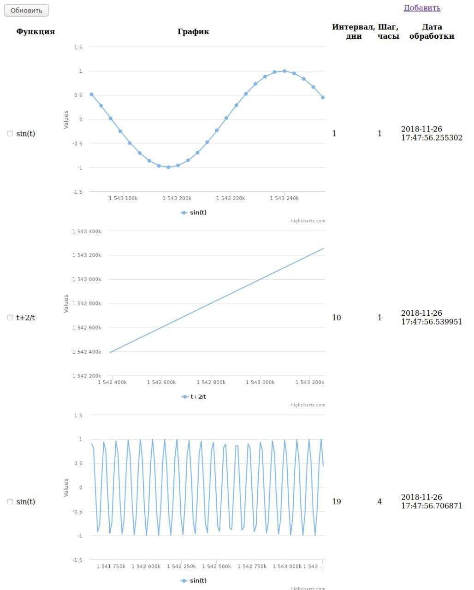

## System story
### Приложение состоит из трех сервисов:
<b>Сервис1</b> - админка, отвечает за взаимодействие с пользователем, хранение и отображение пользователю информации о введенных функциях и сгенерированных графиках.

<b>Сервис2</b> - генератор данных, отвечает за генерацию данных для графика. Принимает одрну из двух предустановленных функции, генерирует по ним массив [(x, y)]. 

<b>Сервис3</b> - генератор изображений, генерирует изображение по подготовленным данным. 

### Сценарий взаимодействия при добавлении новой функции:

1. Сервис1 сохраняет инфу о функции в БД и запускает операцию получения изображения.
2. Операция получения изображения сервиса1 обращается в сервис2 через REST API, передавая функцию в текстовом виде и параметры.
3. Сервис2 обрабатывает запрос, генерирует точки для графика по переданным данным.
4. Сервис1 получает точки и передает их в сервис3 по REST API.
5. Сервис3 принимает набор точек и возвращает изображение.
6. Сервис1 получает изображение и сохраняет в БД, обновляет дату обновления.

### Как запустить

```bash
sudo apt install virtualbox vagrant
vagrant up 
# troubleshooting
vagrant ssh
sudo docker container ls
# если в списке нет alytics_point_generator
# а его там не будет, и х.з почему
# то нужно выйти и сделать provision еще раз
exit
vagrant provision
# теперь всё должно работать
firefox http://127.0.0.1:5001/ # or your favorite web browser
```

### Как выглядит



### Поддержка функций

```
sin(t)
t+2/t
```

t - unix timestamp


